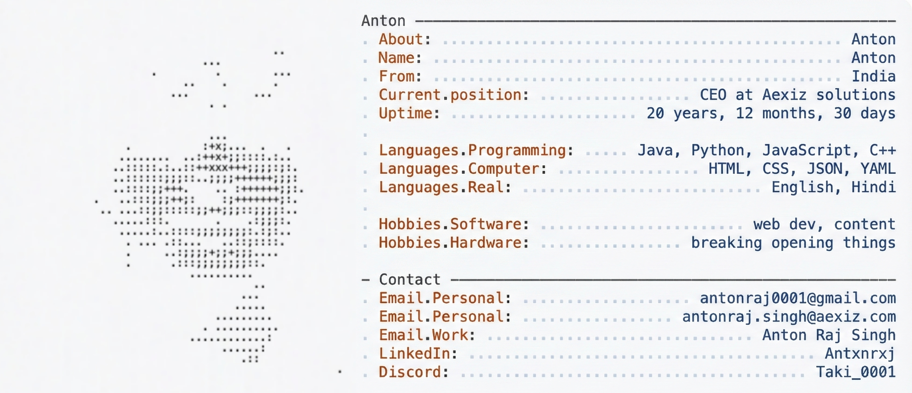

<!-- HERO IMAGE -->
<picture>
  <source srcset="photos/Picsart_25-12-30_23-29-09-908.jpg" media="(prefers-color-scheme: dark)">
  <source srcset="photos/Picsart_25-12-30_23-26-56-222.jpg" media="(prefers-color-scheme: light)">
  
</picture>

 

<!-- ================= ROW 1 ================= -->

  

    <h3>Programming Languages</h3>
    

      
      
      
      
      
      
    

  

  

    <h3>Frontend Development</h3>
    

      
      
      
      
      
    

  

  

    <h3>Backend Development</h3>
    

      
      
      
    

  

 

<!-- ================= ROW 2 ================= -->

  

    <h3>Databases & Caching</h3>
    

      
      
      
      
    

  

  

    <h3>Cloud & Deployment</h3>
    

      
      
      
      
      
      
    

  

  

    <h3>DevOps & Tooling</h3>
    

      
      
      
      
      
    

  

 

<!-- ================= ROW 3 ================= -->

  

    <h3>Developer Tools</h3>
    

      
      
      
      
    

  

  

    <h3>Design & Creative</h3>
    

      
      
      
      
      
      
    

  

  

    <h3>AI & LLM Platforms</h3>
    

      
      
      
    

  

 

<!-- ================= ROW 4 ================= -->

  

    <h3>Productivity</h3>
    

      
      
    

  

  

    <h3>Platforms & CMS</h3>
    

      
      
      
    

  

